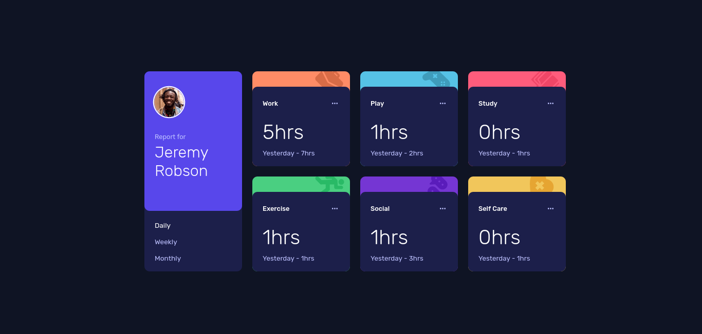
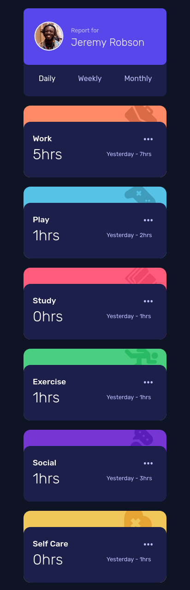

# Frontend Mentor - Time tracking dashboard solution

This is a solution to the [Time tracking dashboard challenge on Frontend Mentor](https://www.frontendmentor.io/challenges/time-tracking-dashboard-UIQ7167Jw). Frontend Mentor challenges help you improve your coding skills by building realistic projects.

## Table of contents

- [Overview](#overview)
  - [The challenge](#the-challenge)
  - [Screenshot](#screenshot)
  - [Links](#links)
- [My process](#my-process)
  - [Built with](#built-with)
  - [What I learned](#what-i-learned)
  - [Continued development](#continued-development)
  - [Useful resources](#useful-resources)
- [Author](#author)

## Overview

### The challenge

Users should be able to:

- View the optimal layout for the site depending on their device's screen size
- See hover states for all interactive elements on the page
- Switch between viewing Daily, Weekly, and Monthly stats

### Screenshot

Desktop version :



Mobile version :



### Links

- Solution URL: [https://github.com/Nivas23/Time-tracking-dashboard](https://github.com/Nivas23/Time-tracking-dashboard)
- Live Site URL: [https://time-tracking-dashboard-five-omega.vercel.app/](https://time-tracking-dashboard-five-omega.vercel.app/)

## My process

### Built with

- Semantic HTML5 markup
- CSS
- Flexbox
- CSS Grid
- JSON
- Vanilla Javascript
- Fetch API


### What I learned

- Learned to use CSS media query.
- Learned to use the absolute positioning in CSS.
- Learned how to write optimized Javascript.

The following Javascript snippet is the optimized version which is orginally 36 lines of code: 

```js
for (let i = 0; i < 6; i++) {
  document.getElementById(`${title[i]}-time`).textContent =
    data[i].timeframes[`${choice}`].current + "hrs";
  document.getElementById(`${title[i]}-prev`).textContent =
    `${time[choice]} - ` + data[i].timeframes[`${choice}`].previous + "hrs";
}
```
### Continued development

- Still there is more to learn about media query and responsive design.

- Styling can be improved.

- Boreder leak can be fixed.

### Useful resources

- [Learn the basics the css position property (by freecodecamp)](https://www.freecodecamp.org/news/learn-the-basics-the-css-position-property/) - This article helped to refresh the position attribute in CSS
- [npoint.io](https://www.npoint.io/) - This website helped me to set up a lightweight JSON endpoint.

## Author

- Frontend Mentor - [@Nivas23](https://www.frontendmentor.io/profile/Nivas23)

